# Project: Build a Traffic Sign Recognition Classifier


---
## Step 0: Load The Data


```python
# Load pickled data
import pickle

training_file = "sdcnd_p2/train.p"
testing_file = "sdcnd_p2/test.p"

with open(training_file, mode='rb') as f:
    train = pickle.load(f)
with open(testing_file, mode='rb') as f:
    test = pickle.load(f)
    
X_train, y_train = train['features'], train['labels']
X_test, y_test = test['features'], test['labels']
```

---

## Step 1: Dataset Summary & Exploration

The pickled data is a dictionary with 4 key/value pairs:

- `'features'` is a 4D array containing raw pixel data of the traffic sign images, (num examples, width, height, channels).
- `'labels'` is a 2D array containing the label/class id of the traffic sign. The file `signnames.csv` contains id -> name mappings for each id.
- `'sizes'` is a list containing tuples, (width, height) representing the the original width and height the image.
- `'coords'` is a list containing tuples, (x1, y1, x2, y2) representing coordinates of a bounding box around the sign in the image. **THESE COORDINATES ASSUME THE ORIGINAL IMAGE. THE PICKLED DATA CONTAINS RESIZED VERSIONS (32 by 32) OF THESE IMAGES**

####Basic data summary below.


```
Number of training examples = 39209
Number of testing examples = 12630
Image data shape = (32, 32, 3)
Number of classes = 43
```

####Visualize the German Traffic Signs Dataset using the pickled file(s). 


`22` is the number of class.

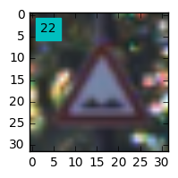


####Distribution of data

Its distribution is really biased, I need to tackle this problem in data-preprocessing phase.

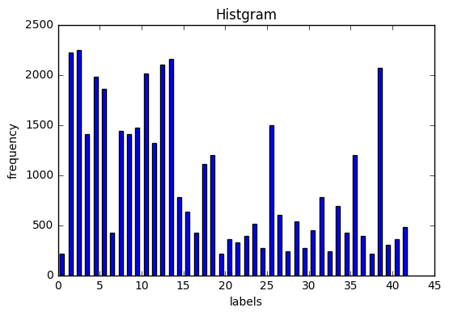


----

## Step 2: Design and Test a Model Architecture

### Step 2-a: Data Augmentation
#### Generate additional data for underrepresented classes
Codes are in 5th and 6th cell in `Traffic_Sign_Classifier.ipynb`.
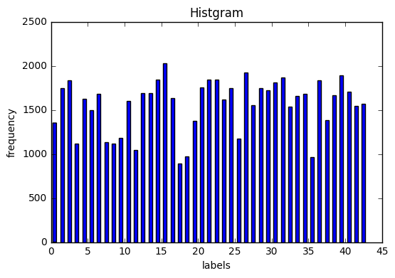

#### Rotating image

`23` is the number of class. The right one is the image after normalizing brightness of the left one. 

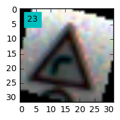


#### Question 1 

_Describe how you preprocessed the data. Why did you choose that technique?_

**Answer:** I found the distribution of data over class was biased, so I wrote codes to augment data in a way that the unbalanced distribution would be improved. As a result of the augmentation, the distribution of the data is much improved.

I normalized features in a range from -0.5 to 0.5. I also normalized brightness by using `cv2.equalizeHist function`.

#### Question 2

_Describe how you set up the training, validation and testing data for your model. **Optional**: If you generated additional data, how did you generate the data? Why did you generate the data? What are the differences in the new dataset (with generated data) from the original dataset?_

**Answer:** Testing data is coming from original code(X_test and y_test). All I did here for setting up data was to make validation data. I create validation data from the original training data. So now, the proportion of each data set is 0.6, 0.2, 0.2 in each training data, validation data and testing data. 
As I mentioned in Question 1, I generated the new data so that the biased ditributrion in the original data would be improved.

### Step 2-b: Architecture

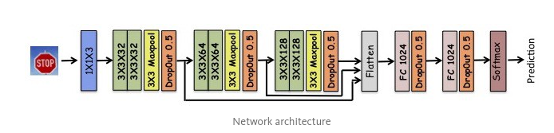


#### Question 3

_What does your final architecture look like? (Type of model, layers, sizes, connectivity, etc.)  For reference on how to build a deep neural network using TensorFlow, see [Deep Neural Network in TensorFlow
](https://classroom.udacity.com/nanodegrees/nd013/parts/fbf77062-5703-404e-b60c-95b78b2f3f9e/modules/6df7ae49-c61c-4bb2-a23e-6527e69209ec/lessons/b516a270-8600-4f93-a0a3-20dfeabe5da6/concepts/83a3a2a2-a9bd-4b7b-95b0-eb924ab14432) from the classroom._


**Answer:** My architecture is mostly coming from [the blog post](https://chatbotslife.com/german-sign-classification-using-deep-learning-neural-networks-98-8-solution-d05656bf51ad#.op0ez044x) written by Vivek Yadev, who is one of the udacity student. The architecture are comprised of basic convoulutional layers and fully connected layers. I added drop-out layers since it prevents the model from over-fitting.


#### Question 4

_How did you train your model? (Type of optimizer, batch size, epochs, hyperparameters, etc.)_


**Answer:** I chose Adamoptimizer since it is the first choice for an optimizer in terms of the efficiency. Batch size is 128 amd epoch is 500. I could not run anymore because running the model took more than 12 horus. Firat, learning rate was set to relatively high so that the paramators in weight would be optimized quickly, but later I changed more smaller learning rate so that the more accurate score would be achieved. This idea is coming from [CS231n lecture](http://cs231n.github.io/neural-networks-3/).

#### Question 5


_What approach did you take in coming up with a solution to this problem? It may have been a process of trial and error, in which case, outline the steps you took to get to the final solution and why you chose those steps. Perhaps your solution involved an already well known implementation or architecture. In this case, discuss why you think this is suitable for the current problem._

**Answer:** I tried many methods to improve score, which includes data normalization, regularlization, CNN architecute, weight initialization and visualization of accuracy rate.


##Final Test Accuracy : 0.971
---

## Step 3: Test a Model on New Images

Take several pictures of traffic signs that you find on the web or around you (at least five), and run them through your classifier on your computer to produce example results. The classifier might not recognize some local signs but it could prove interesting nonetheless.

### New Images


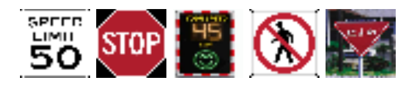


### Question 6

_Choose five candidate images of traffic signs and provide them in the report. Are there any particular qualities of the image(s) that might make classification difficult? It could be helpful to plot the images in the notebook._


**Answer:** Most new signs are unknow to the model except for the stop sign. In addition, since two speed limit signs contain characters along with figures, they should be difficult to predict for the model.  


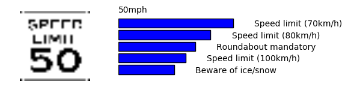


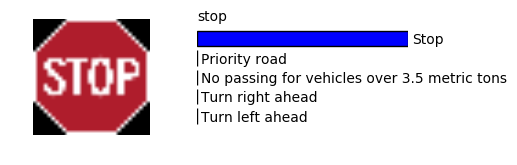


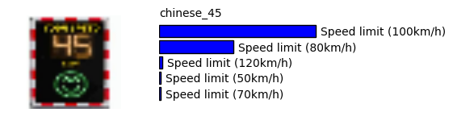


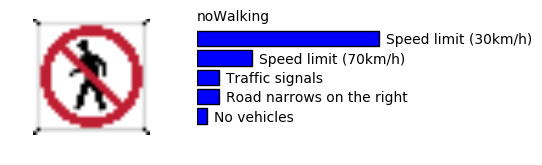


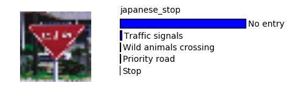


### Question 7

_Is your model able to perform equally well on captured pictures when compared to testing on the dataset? The simplest way to do this check the accuracy of the predictions. For example, if the model predicted 1 out of 5 signs correctly, it's 20% accurate._


**Answer:** The model predicted two signs out of five test data, so accuracy rate is 40%. This accuracy rate is much less than 97%, which is the accuracy rate for the German Traffic Signs test dataset.

### Question 8
Use the model's softmax probabilities to visualize the certainty of its predictions, tf.nn.top_k could prove helpful here. Which predictions is the model certain of? Uncertain? If the model was incorrect in its initial prediction, does the correct prediction appear in the top k? (k should be 5 at most)

**Answer:** The model predicted two signs correctly with high percentage, while the others are predicted poorly. 


